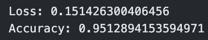

## Introduction 📜

This project belongs to the Advanced AI Module and is part of the third-year engineering curriculum.</br></br>

It consists of building a deep learning model for classifying lung images into three categories (COVID, NORMAL, PNEUMONIA) using a Convolutional neural network (CNN).</br>
</br>
We will have a graphical interface from which we can test different images to determine the system's relevance.

## Authors ©️
</br>
<ul>
  <li>Abdennour Samaali
</li></br>
    <li>Azer Lahmar</li>
</br>
      <li>Mohamed Amine Kaabi</li></br>
      <li>Yassine Layouni</li></br>
</ul>

## Dataset 📥
<a name="inputs"></a>
The dataset consists of 5228 lung images in PNG format with a size of 256x256 pixels, divided into three categories:
* COVID: 1626 images
* NORMAL: 1802 images
* PNEUMONIA: 1800 images
</br>


## Libraries  💡
<a name="libraries "></a>

📌Numpy

* We used Numpy for manupliting the dimensions of the image
For more you can read the official documentation on the [Numpy](https://numpy.org/doc/stable/). 

📌Matplotlib

* We used Matplotlib for displaying the training history of the model and displaying the image itself.

For more you can read the official documentation on the [Matplotlib](https://matplotlib.org/stable/index.html)

📌Splitfolders

* We used Splitfolders to  divide the dataset randomly into  randomly into 3 datasets: 

📁training 

📁Validation

📁testing  

For more you can read the official documentation on the [Splitfolders](https://pypi.org/project/split-folders/)

📌Tensorflow (Keras)

* We have utilized Keras multiple times throughout this project for various purposes.

For more you can read the official documentation on the [Keras](https://www.tensorflow.org/guide/keras)

## Data prepartion 💡
<a name="data-prepartion"></a>

Before building the Model We have to prepare the datasetsinto training, test, and validation sets.

Preprocessing is needed for both the training and test sets, but it's important to avoid data leakage.
The validation set is used to evaluate and fine-tune the model during training, helping to assess its performance and make adjustments.
It's essential to split the data to prevent overfitting and ensure that the model generalizes well to new data


```
#Split Dataset into 3 folders (train, test and validation)
splitfolders.ratio('./3IDL_DataSet/', output="Output_DataSet", seed=1337, ratio=(0.6,0.2,0.2))
# Set the path to your dataset directory
path_dataset = './Output_DataSet'
```


Define parameters

```
img_dim =256
batch_size = 32

```


Data augmentation and training prepartion

```
train_data = ImageDataGenerator(
    rescale=1./255,
    shear_range=0.2,
    zoom_range=0.2,
    horizontal_flip=True
)

train = train_data.flow_from_directory(
    os.path.join(path_dataset, 'train'),
    target_size=(img_dim, img_dim),
    batch_size=batch_size,
    class_mode='categorical'
)

```


 Data rescaling
```
test_data = ImageDataGenerator(rescale=1./255)

```

Validation data prepartion
```
validation = test_data.flow_from_directory(
    os.path.join(path_dataset, 'val'),
    target_size=(img_dim, img_dim),
    batch_size=batch_size,
    class_mode='categorical'
```


## Building the Model 💡
<a name="building-the-model"></a>

```
# Create a Sequential model
model = Sequential()

# Add the first convolutional layer with 32 filters and size 3x3
model.add(Conv2D(32, (3, 3), input_shape=(img_dim, img_dim, 3), activation='relu'))

# Add max pooling layer
model.add(MaxPooling2D(pool_size=(2, 2)))

# Add the second convolutional layer with 64 filters and size 3x3
model.add(Conv2D(64, (3, 3), activation='relu'))
model.add(MaxPooling2D(pool_size=(2, 2)))

# Add the third convolutional layer with 128 filters and size 3x3
model.add(Conv2D(128, (3, 3), activation='relu'))
model.add(MaxPooling2D(pool_size=(2, 2)))

#Flatten the output from the previous layer into a one-dimensional array.
model.add(Flatten())

# Add a dense layer with 256 units and ReLU activation
model.add(Dense(256, activation='relu'))

# Add a dropout layer with a dropout rate of 0.5
model.add(Dropout(0.5))

# Add the output layer with 3 units (one unit per class) and softmax activation
model.add(Dense(3, activation='softmax'))

# Compile the model
model.compile(optimizer='adam', loss='categorical_crossentropy', metrics=['accuracy'])

#Display the model summary
model.summary()

```


## Training the Model 💡
<a name="training-the-model"></a>
Training the model in deep learning is essential to enable it to learn from the data and make predictions. 
During the training process, the model adjusts its internal parameters to minimize a loss function, which measures the difference between the predicted output and the actual output
```
# Training the model using the fit method
history = model.fit(train, steps_per_epoch=train.samples // batch_size,
                    epochs=10,
                    validation_data=validation,validation_steps=validation.samples // batch_size )

# Plot training history per epochs (iteration)
plt.plot(history.history['accuracy'], label='Training Accuracy')
plt.plot(history.history['val_accuracy'], label='Validation Accuracy')
plt.xlabel('Epoch')
plt.ylabel('Accuracy')
plt.legend()
plt.show()
```


## Saving the Model 💡
<a name="saving-the-model"></a>
Saving the model in deep learning is important to reuse the trained model for making predictions on new data without having to retrain the model from scratch.
Saving the model allows us to share it with others
```
# Save the model into (HDF5)
model.save('classifier_model.h5')
```

## Testing the Model 💡
<a name="testing-the-model"></a>
A small example 
```
# Load a sample image from the testset for a prediction
test_img = './Test/PNEUMONIA_899.png'

# Load the imag
img = image.load_img(test_img, target_size=(256, 256))

#Convert the image to a NumPy array
img_array = image.img_to_array(img)

# Expand the dimensions of the image
img_array = np.expand_dims(img_array, axis=0)

# Rescale the pixel values to be in the range [0, 1]
img_array /= 255.0

#Show the image
plt.imshow(img)

#Predict the image class
predictions = model.predict(img_array)

#  Class labels
labels = ['COVID', 'Normal', 'Pneumonia']

# Display the predicted class
predicted_class = labels[np.argmax(predictions)]
print(f"Predicted class: {predicted_class}")
```


## Model evaluation 💡
<a name="model-evaluation"> </a>
The evaluation of Convolutional Neural Networks (CNNs) plays a crucial role in assessing their performance and ensuring their effectiveness in image recognition.
Our evaluation for our model consists of various metrics:
1. Accuracy
2. Loss
3. Recall
4. Precision
5. Support
6. f1-scores
6. Confusion Matrix

```
# Load pre-trained model
model = load_model('./classifier_model.h5')

# Data rescaling
test_data_generator = ImageDataGenerator(rescale=1./255)

#  Testing data prepartion
test_generator = test_data_generator.flow_from_directory(
    os.path.join(path_dataset, 'test'),
    target_size=(img_dim, img_dim),
    batch_size=batch_size,
    class_mode='categorical',
    shuffle= False
)

evaluation = model.evaluate_generator(test_generator)

# Print the evaluation results
print("Loss:", evaluation[0])
print("Accuracy:", evaluation[1])


#Confution Matrix and Classification Report
y_pred = model.predict_generator(test_generator)
# Get predictions and true labels

y_true = test_generator.classes

# Convert probabilities to class labels
y_pred_classes = np.argmax(y_pred, axis=1)

# Compute confusion matrix
conf_mat = confusion_matrix(y_true, y_pred_classes)

# Plot confusion matrix as a heatmap
plt.figure(figsize=(8, 6))
sns.heatmap(conf_mat, annot=True, fmt='d', cmap='Blues', cbar=False,
            xticklabels=test_generator.class_indices.keys(),
            yticklabels=test_generator.class_indices.keys())
plt.xlabel('Predicted Labels')
plt.ylabel('True Labels')
plt.title('Confusion Matrix')
plt.show()

# Print classification report
print(classification_report(y_true, y_pred_classes, target_names=test_generator.class_indices.keys()))
```



## Interface 💡
<a name="interface"> </a>
The interface is created using pthon library Streamlit, it allows the upload of a PNG image (Lungs), and returns the predicted class (Normal/COVID/Pneumonia)

```
if uploaded_file is not None:
    # Display the uploaded image
    st.image(uploaded_file, caption="Uploaded Image.", use_column_width=True)

    # Save the uploaded image locally
    save_button = st.button("Predict Image")
    if save_button:
        image = Image.open(uploaded_file)
        img_path = "./UploadedImages/"+uploaded_file.name
        image.save(img_path)
        predicted_class, confidence = predict_img(img_path)
        st.success("Classification : " + predicted_class + ", with a confidence of : " + confidence.astype(str) + "%")
```

To lanch the interface execute this command : 
```
streamlit run Interface.py
```

